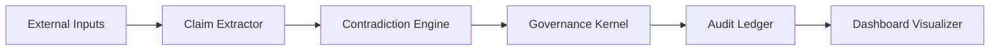

# Tessrax Architecture Overview

Tessrax orchestrates contradiction-aware governance as a sequence of verifiable services. The diagram below outlines the control flow from ingestion through public audit.

## Data Flow Narrative

1. **Input** – Text streams, structured metrics, or policy updates enter through adapters. Connectors normalise timestamps, provenance, and contextual metadata.
2. **Claim Extractor** – The extractor decomposes inputs into atomic, typed claims (numeric, normative, temporal). Each claim is signed with its source channel and confidence.
3. **Contradiction Engine** – Contradictions are detected by combining symbolic checks (difference tolerances, precedence rules) with learned semantics (NLI-style entailment models). The engine emits contradiction records with severity, affected actors, and supporting evidence.
4. **Governance Kernel** – Protocol rules metabolise contradictions. The kernel weighs Memory, Metabolism, Governance, and Trust directives to decide resolutions (escalate, accept, remediate, or archive) and compute Clarity Fuel deltas.
5. **Audit Ledger** – Every governance action is persisted as an append-only receipt. Entries include request IDs, protocol decisions, hashes, signatures, and optional Merkle proofs.
6. **Dashboard Visualizer** – Presentation layers provide near-real-time status, historical comparisons, and contradiction metabolism analytics for auditors and operators.

## Contradiction Handling Matrix

| Stage | Purpose | Key Artifacts | Failure Modes |
| --- | --- | --- | --- |
| Claim Extractor | Normalise raw evidence into structured claims. | Canonical claim JSON, provenance metadata. | Source drift, schema mismatch. |
| Contradiction Engine | Detect and score conflicts. | Contradiction packets, severity metrics. | False positives, stale thresholds. |
| Governance Kernel | Apply protocols and compute actions. | Governance receipts, Clarity Fuel deltas. | Policy misconfiguration, quorum stalemate. |
| Audit Ledger | Provide tamper evident history. | Ledger receipts, hash chain, signatures. | Hash breaks, key rotation issues. |
| Dashboard Visualizer | Communicate state and evolution. | Dashboards, exports, health reports. | Latency spikes, stale caches. |

## Future Extensions

- **Adaptive connectors** that learn normalisation strategies for new data sources without manual mappings.
- **Policy simulation sandboxes** allowing teams to replay historic contradictions against experimental governance rules.
- **Zero-knowledge proofs** for selective disclosure of ledger receipts while preserving verifiability.
